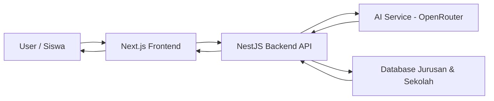
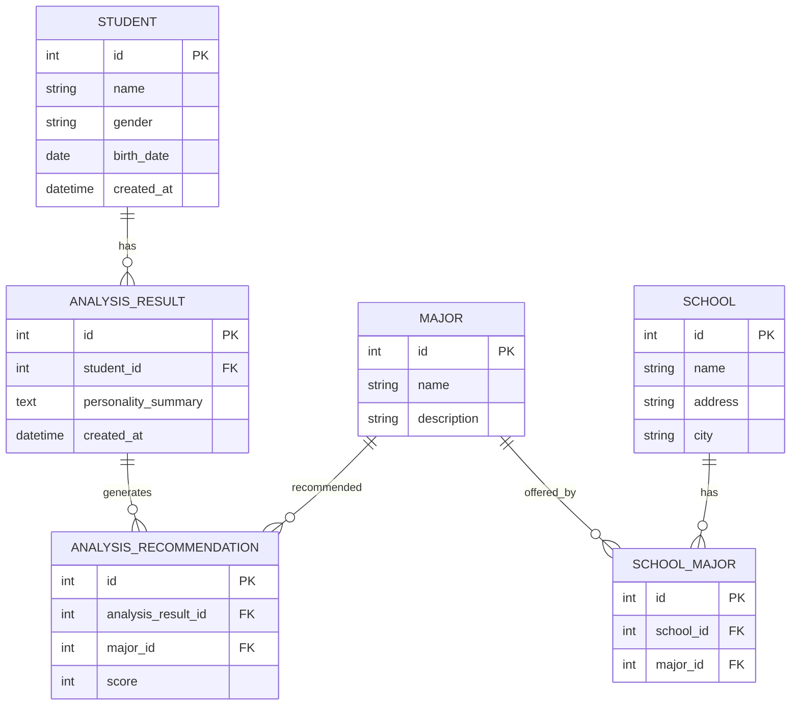
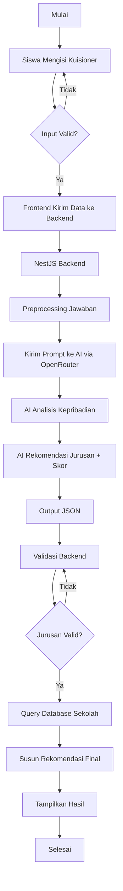

# 🎓 Sistem Rekomendasi Jurusan SMK Berbasis AI

## 📌 Tentang Repository Ini

Repository ini berisi source code **Sistem Rekomendasi Jurusan SMK Berbasis AI** yang dirancang untuk membantu siswa SMP menentukan jurusan SMK yang paling sesuai berdasarkan **minat, kebiasaan, dan kecenderungan kepribadian**.

Sistem ini menggunakan **Artificial Intelligence (LLM)** sebagai *decision support system*, bukan sebagai penentu keputusan mutlak. Semua hasil AI **divalidasi oleh backend** dan dicocokkan dengan data jurusan serta sekolah yang tersedia di database.

---

## 🎯 Tujuan Pengembangan

Tujuan utama pengembangan sistem ini adalah:

* Membantu siswa SMP mengenali potensi dan minat diri
* Memberikan rekomendasi jurusan SMK yang rasional dan terukur
* Menyediakan daftar sekolah yang memiliki jurusan terkait
* Menerapkan AI secara **terkontrol, akademis, dan bertanggung jawab**
* Menjadi studi kasus implementasi AI di bidang pendidikan

---

## 🧠 Konsep Sistem

Alur kerja sistem secara umum:

1. Siswa mengisi kuisioner (minat, kebiasaan, preferensi)
2. Data dikirim ke backend (NestJS)
3. Backend memproses dan menyusun prompt
4. AI menganalisis kecenderungan siswa
5. AI menghasilkan rekomendasi jurusan + skor kecocokan (JSON)
6. Backend memvalidasi hasil AI dengan database
7. Sistem mengambil data sekolah terkait
8. Hasil akhir ditampilkan ke pengguna

AI **tidak pernah langsung menentukan hasil akhir**, seluruh keputusan tetap dikontrol oleh sistem.

---

## 🛠️ Teknologi yang Digunakan

### Frontend

* Next.js 14 (App Router)
* TypeScript
* React
* (Opsional) Tailwind CSS

### Backend

* NestJS
* TypeScript
* REST API

### Artificial Intelligence

* OpenRouter API
* Model LLM (GPT / Claude / LLaMA)

### Database

* PostgreSQL / MySQL
* ORM: Prisma

---

## 🧩 Arsitektur Sistem



---

## 🗂️ Entity Relationship Diagram (ERD)



---

## 🔄 Flowchart Proses Sistem



---

## 📂 Struktur Folder (Garis Besar)

```bash
root
├─ frontend/            # Next.js Frontend
│  ├─ app/
│  └─ components/
│
├─ backend/             # NestJS Backend
│  ├─ src/
│  │  ├─ ai/            # Integrasi OpenRouter
│  │  ├─ major/         # Master Jurusan
│  │  ├─ school/        # Master Sekolah
│  │  ├─ school-major/  # Relasi sekolah & jurusan
│  │  └─ analysis/      # Analisis & rekomendasi
│  └─ main.ts
│
└─ README.md
```

---

## 🔰 Tahapan Pengembangan Sistem

### ⚙️ Tahap 1 — Setup Backend Core

* Init NestJS Project
* ENV Configuration (Database & OpenRouter)
* Setup Prisma ORM
* Prisma Service & Module

**Output:** Backend siap query database

---

### 🗃️ Tahap 2 — Data Master

* Seeder Jurusan (Major)
* Seeder Sekolah (School)
* Seeder Relasi School-Major
* CRUD Master Data

Endpoint minimal:

* `GET /majors`
* `GET /schools?majorId=`

**Output:** Data master siap digunakan

---

### 🧠 Tahap 3 — Analysis System (Tanpa AI)

* Module analysis
* Simpan data siswa & jawaban
* Simpan hasil analisis dummy
* Validasi DTO & error handling

**Output:** Flow sistem berjalan stabil

---

### 🤖 Tahap 4 — Integrasi AI

* Integrasi OpenRouter
* Prompt terkontrol
* Output wajib JSON
* Validasi hasil AI

**Output:** AI aman dan akademis

---

### 🎨 Tahap 5 — Frontend

* Setup Next.js App Router
* Form kuisioner siswa
* Halaman hasil rekomendasi

**Output:** Sistem bisa digunakan user

---

### 🚀 Tahap 6 — Polishing & Akademis

* Penjelasan hasil rekomendasi
* Disclaimer AI
* Dokumentasi & README

**Output:** Layak presentasi dan akademik

---

## 🧾 Ringkasan Pegangan

> **Konsep → ENV → DB → Seeder → CRUD → Analysis → AI → Frontend**

---

## 📌 Catatan Penting

* Sistem ini **tidak menggantikan konselor pendidikan**
* AI bersifat pendukung analisis
* Semua hasil AI divalidasi backend

---

## 🚀 Pengembangan Lanjutan

* Akun siswa & histori analisis
* Dashboard admin
* Visualisasi skor
* Perbandingan multi-model AI
* Export hasil (PDF)

---

## 📄 Lisensi

Project ini dikembangkan untuk keperluan **edukasi dan akademik**.

---

## 🙌 Penutup

Project ini diharapkan menjadi contoh penerapan AI yang **etis, terkontrol, dan bermanfaat** dalam membantu siswa menentukan jurusan pendidikan yang sesuai dengan potensi mereka.
