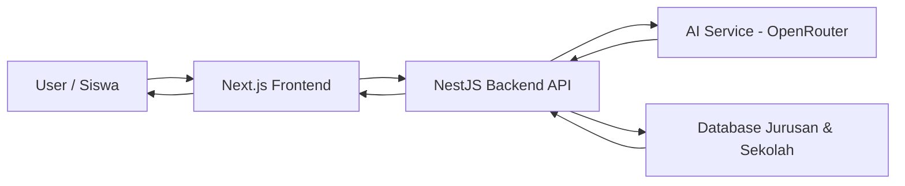
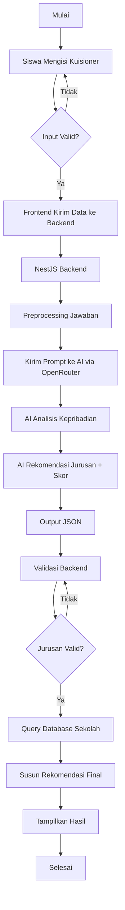

# 🎓 Sistem Rekomendasi Jurusan SMK Berbasis AI

## 📌 Tentang Repository Ini

Repository ini berisi source code **Sistem Rekomendasi Jurusan SMK Berbasis AI** yang dirancang untuk membantu siswa SMP menentukan jurusan SMK yang paling sesuai berdasarkan **kepribadian, minat, dan preferensi** mereka.

Sistem ini memanfaatkan **Artificial Intelligence (LLM)** sebagai alat bantu analisis (decision support system), bukan sebagai pengambil keputusan mutlak. Hasil analisis AI akan divalidasi oleh sistem dan dipadukan dengan data jurusan serta sekolah yang tersedia di database.

---

## 🎯 Tujuan Pengembangan

Tujuan utama dari project ini adalah:

* Membantu siswa SMP mengenali kecenderungan minat dan kepribadian mereka
* Memberikan rekomendasi jurusan SMK yang relevan dan rasional
* Menyediakan daftar sekolah yang memiliki jurusan terkait
* Menerapkan teknologi AI secara **terkontrol, terstruktur, dan akademis**
* Menjadi implementasi nyata pemanfaatan AI dalam sistem pendidikan

---

## 🧠 Konsep Sistem

Sistem bekerja dengan alur sebagai berikut:

1. Siswa mengisi kuisioner (minat, kebiasaan, preferensi)
2. Data dikirim ke backend untuk diproses
3. AI menganalisis kepribadian dan kecenderungan siswa
4. AI memberikan skor kecocokan terhadap jurusan SMK
5. Backend memvalidasi hasil AI
6. Sistem mengambil data sekolah dari database
7. Rekomendasi akhir ditampilkan ke pengguna

AI hanya berperan sebagai **alat analisis**, sementara keputusan akhir tetap dikontrol oleh sistem.

---

## 🛠️ Teknologi yang Digunakan

### Frontend

* **Next.js 14 (App Router)**
* **TypeScript**
* React
* (Opsional) Tailwind CSS

### Backend

* **NestJS**
* **TypeScript**
* REST API

### Artificial Intelligence

* **OpenRouter API**
* Model LLM (GPT / Claude / LLaMA sesuai kebutuhan)

### Database

* PostgreSQL / MySQL
* ORM: Prisma

---

## 🧩 Arsitektur Sistem



---

## 🔄 Flowchart Proses Sistem



---

## 📂 Struktur Folder (Garis Besar)

```bash
root
├─ frontend/        # Next.js Frontend
│  ├─ app/
│  └─ components/
│
├─ backend/         # NestJS Backend
│  ├─ src/
│  │  ├─ ai/
│  │  ├─ jurusan/
│  │  ├─ sekolah/
│  │  └─ analysis/
│  └─ main.ts
│
└─ README.md
```

---

## 📌 Catatan Penting

* Sistem ini **tidak menggantikan peran konselor pendidikan**
* AI digunakan sebagai pendukung analisis, bukan penentu mutlak
* Semua hasil AI divalidasi sebelum ditampilkan ke pengguna

---

## 🚀 Pengembangan Lanjutan

Beberapa fitur yang dapat dikembangkan ke depannya:

* Akun siswa dan histori hasil analisis
* Dashboard admin untuk kelola jurusan & sekolah
* Visualisasi skor kecocokan
* Multi-model AI comparison
* Export hasil rekomendasi (PDF)

---

## 📄 Lisensi

Project ini dikembangkan untuk keperluan edukasi dan akademik.

---

## 🙌 Penutup

Project ini diharapkan dapat menjadi contoh implementasi AI yang **etis, realistis, dan bermanfaat** dalam dunia pendidikan, khususnya dalam membantu siswa menentukan jalur pendidikan yang sesuai dengan potensi mereka.
